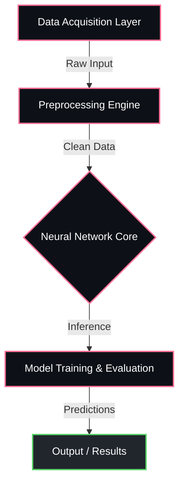

<div align="center">


<p align="center">
  
  
  
  
</p>

  
  
  


</div>

---

## Overview

> Web-based radio player with background streaming.

**Radio Streaming** is a proprietary machine learning / ai system engineered by **Karthik Idikuda**. It leverages TypeScript, React, Next.js for its core functionality.

<br/>

## System Architecture



<br/>

## Project Structure

```
Radio-Streaming/
  .gitignore
  LICENSE
  README.md
  next-env.d.ts
  package-lock.json
  package.json
  tsconfig.json
  tsconfig.tsbuildinfo
  app/
    globals.css
    layout.tsx
    page.tsx
  components/
    ActivityTimeline.tsx
    CalibrationWizard.tsx
    Dashboard.tsx
    Heatmap.tsx
    LiveRadar.tsx
  lib/
    advanced-csi-engine.ts
    ambient-light.ts
    audio-sonar.ts
    bluetooth-scanner.ts
    data-export.ts
```

<br/>

## Technical Specifications

| Attribute | Detail |
|:---|:---|
| **Primary Language** | `TypeScript` |
| **Project Category** | `Machine Learning / AI` |
| **Total Source Files** | `40` |
| **Frameworks** | `TypeScript`, `React`, `Next.js` |
| **Key Dependencies** | `jspdf` | `next` | `three` | `@tensorflow/tfjs` | `@types/react` | `eslint-config-next` | `typescript` | `react-dom` | `idb` | `react` | `eslint` | `@react-three/fiber` | `@react-three/drei` | `@types/node` |
| **Intellectual Property** | `Strictly Proprietary` |

<br/>

## STRICT LEGAL WARNING & LICENSE

> **PROPRIETARY AND CONFIDENTIAL**

This software and all associated documentation are the **exclusive property of Karthik Idikuda**.

- **NO PERMISSION IS GRANTED** to use, copy, modify, merge, publish, distribute, sublicense, or sell copies of this software without explicit, written consent from the author.
- **UNAUTHORIZED USE WILL RESULT IN SEVERE LEGAL ACTION.** Any individual or organization found using, referencing, or deploying this code without paying the required licensing fees will face immediate litigation, financial penalties, and potentially criminal prosecution where applicable by law.
- **TO OBTAIN A LEGAL LICENSE**, you must directly contact Karthik Idikuda to negotiate payment terms.

*By accessing this repository, you acknowledge and accept these strict proprietary terms.*

---

<div align="center">
  
</div>

<!-- TRACKING: S0ktUmFkaW8tU3RyZWFtaW5nLVRSQUNL -->
